# 【架构选型】微服务日志零侵入升级：基于 Filebeat 构建轻量级 ELK 追踪体系

@[TOC](文章目录)

# 一、前言：业务背景与痛点
在上一篇 [（十一）Spring Cloud Alibaba 2023.x：构建分布式全链路日志追踪体系](https://blog.csdn.net/qq_39818325/article/details/159213048) 中，我们已经深入探讨并成功构建了基于 MDC 的全链路 `traceId` 多服务透传与本地日志持久化滚动落盘。

本篇我们将在该基础之上无缝咬合、重磅升级——以**对业务代码几乎 0 侵入**的优雅姿态，带大家实战落地一套更适合中小体量业务的**“瘦身版 ELK 体系”（Filebeat + Elasticsearch + Kibana 8.x）**，实现跨服务、跨节点的日志数据一键检索！

# 二、技术选型

## 1. 什么是 ELK 日志体系？
对于刚接触微服务日志平台的小白来说，**ELK** 其实是三个核心开源项目的首字母缩写，它们完美配合，形成了一条完整的日志流水线：
* **E (Elasticsearch)**：负责“存储和搜索”，它是强大的海量数据搜索引擎，是整个架构 of the storage heart.
* **L (Logstash)**：负责“采集和清洗”，它像一个极其硬核的加工厂，负责把服务器上的纯文本日志拉过来，用正则切割提取后发给 ES。
* **K (Kibana)**：负责“可视化展示”，它提供了一个极具现代感的网页控制台，让你能在浏览器里图形化地搜日志。

## 2. 采集器选型：Logstash 还是 Filebeat？
搭建日志平台时，切忌盲目照搬大厂的传统 ELK 架构。对于单机资源宝贵的中小型项目，Logstash 作为一款基于 JVM 的重量级组件，动辄占用数 GB 的内存，如果把它部署在应用服务器上，极易喧宾夺主拖垮业务服务。

在真实的业务场景下，采集器的选择应当极其务实：
* **选 Filebeat（轻量级EFK）**：现代新项目。只要前期设计了**标准的日志打印规范**（如统一输出 JSON 格式），无需额外解析清洗，用 Go 语言编写、极其轻量（仅占用十几兆内存）的 Filebeat 做“搬运工”绝对是最优解。
* **选 Logstash（传统ELK）**：祖传老项目。如果历史日志格式杂乱无章，或者需要在采集层进行重度的复杂预处理（如：复杂的正则提取、敏感数据掩码掩饰等），再考虑这把“重武器”。

# 三、核心架构与数据流向
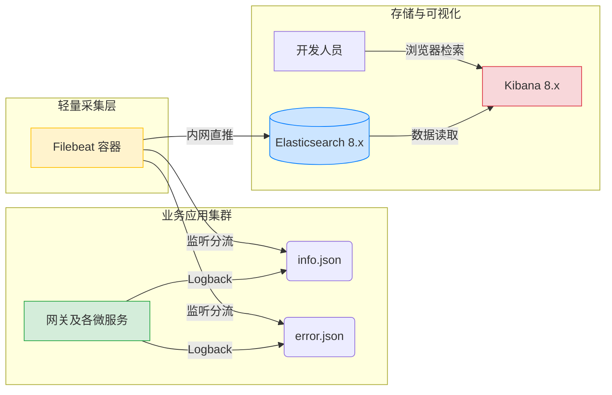

# 四、环境准备
- **完整源码获取**：强烈建议直接拉取代码对照学习：[点击获取 Github 源码](https://github.com/RemainderTime/spring-cloud-alibaba-base-demo)
- **运行环境自闭环**：JDK 17, Spring Boot 3.x, Elasticsearch 8.18, Kibana 8.18, Filebeat 8.18
> **架构技术边界限制**：
> 本方案属于轻量级直连架构（Filebeat -> ES），适用于中小体量的常规并发业务（日均 TB 级别以下日志）。如果在超高并发的大型促销节点导致 ES 写入遭遇瓶颈，则必须在 Filebeat 与 ES 之间横向引入 Kafka 集群做消息削峰。

# 五、实践
## 轻量级 ELK 三件套环境搭建
在开始部署之前，我们需要明确核心“三件套”的职责，并且为了防止底层通信协议冲突，**这三大组件必须保持绝对的版本一致**（本文统一使用 `8.18` 版本）：
* **Elasticsearch**：整个体系的心脏，负责海量日志数据的存储与检索引擎。
* **Kibana**：面向开发人员的 UI 界面，提供图形化的日志搜寻看板。
* **Filebeat**：极其轻量的采集探针，部署在应用同级服务器，负责把生成的本地日志推送到 ES。

### 1. 部署核心心脏：Elasticsearch 8.x
>完整配置文件获取：[点击调整Github](https://github.com/RemainderTime/docker-dosc/tree/master/elasticsearch)

首先，我们通过 `docker-compose.yml` 单独拉起 ES 引擎：
```yaml
version: '3.8'
services:
  elasticsearch:
    image: docker.elastic.co/elasticsearch/elasticsearch:8.18.1
    container_name: elasticsearch
    restart: always
    environment:
      - discovery.type=single-node
      # 继承咱们刚才成功跑起来的内存限制，防止服务器 OOM
      - ES_JAVA_OPTS=-Xms512m -Xmx512m
      # 开启企业级密码认证
      - xpack.security.enabled=true
      - TZ=Asia/Shanghai
    ports:
      - "9200:9200"
      - "9300:9300"
    volumes:
      # 请在此处精准匹配成你自己服务器的物理路径
      - /home/docker/elasticsearch/data:/usr/share/elasticsearch/data
      - /home/docker/elasticsearch/logs:/usr/share/elasticsearch/logs
      - /home/docker/elasticsearch/plugins:/usr/share/elasticsearch/plugins
      - /home/docker/elasticsearch/config:/usr/share/elasticsearch/config
```
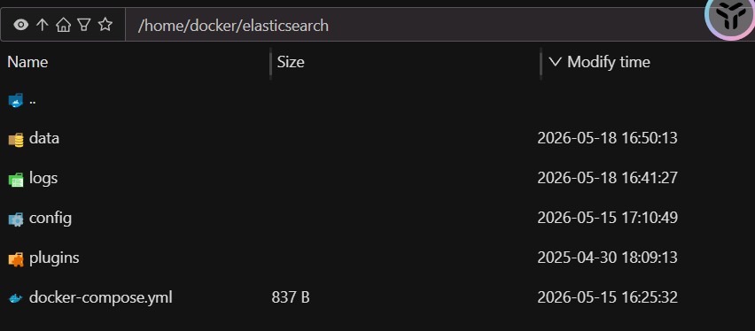
* **挂载路径说明**：`volumes` 冒号左侧必须为您服务器真实的物理路径。强烈建议在拉起容器前，在宿主机上提前把这些目录建好并赋予相应的读写权限，否则很容易因为权限拦截导致 ES 容器启动失败并闪退。

* **🚨 【核心避坑配置】免证书 HTTP 传输配置**：
  ES 8.x 默认强行启用了 HTTP 层的 SSL 加密（强制要求客户端走 `https://` 访问），这在单机或轻量化内网测试阶段，会引入极其复杂的自签名 CA 证书链配置工作。
  为了在轻量化架构中用普通的 `http://` 进行平滑连接，我们需要在宿主机映射出的 **`config/elasticsearch.yml`** 配置文件中，追加或修改如下参数：
  ```yaml
  cluster.name: "docker-cluster"
  network.host: 0.0.0.0
  http.port: 9200
  http.cors.enabled: true
  http.cors.allow-origin: "*"
  xpack.security.http.ssl.enabled: false  # 🌟 显式关闭 HTTP 层的 SSL 认证，开启平滑的 HTTP 访问


> **获取或重置默认管理员密码**：
> 容器首次顺利跑起来后，系统会自动生成一个超级管理员账号，默认账号名固定为：**`elastic`**。
> 至于它的初始密码，您有两种方式可以获取或重置：
> 
> **方式一：去日志查看初始密码**
> 直接在服务器终端执行 `docker logs elasticsearch`，在输出的启动日志中，会有一大块明显的日志输出框，里面打印了系统为您生成的初始随机密码。
> 
> **方式二：简单粗暴直接重置**
> 如果日志刷得太多找不到了也没关系，我们直接进容器给它强制重置一个好记的新密码。执行以下交互式命令，按提示输入并确认新密码即大功告成：
> ```bash
> docker exec -it elasticsearch /usr/share/elasticsearch/bin/elasticsearch-reset-password -u elastic -i
> ```

### 2. 部署采集探针：Filebeat 8.x
ES 准备就绪后，我们来配置并启动采集端的搬运工 Filebeat。
> 完整配置文件获取：[点击调整Github](https://github.com/RemainderTime/docker-dosc/tree/master/filebeat)

**第一步：创建并编写 `filebeat.yml` 配置文件**
我们根据应用产生的不同日志文件打上不同的标签，以便将其推送到 ES 中不同的物理索引：
```yaml
# ============================== Filebeat inputs ===============================
filebeat.inputs:
- type: filestream
  id: microservice-logs
  enabled: true
  # 监控容器内部映射进来的微服务日志路径
  paths:
    - /var/log/microservices/*/*.json 
  
  # 核心：直接把 JSON 日志平铺解析
  parsers:
    - ndjson:
        target: "" 
        add_error_key: true
        message_key: message

# ================================== Outputs ===================================
output.elasticsearch:
  # 这里填你 ES 所在的宿主机 IP 和暴露的端口
  hosts: ["http://172.16.0.3:9200"] 
  username: "elastic"
  password: "密码"
  #取消分流，所有日志统一写入同一个每日索引
  index: "microservice-logs-%{+yyyy.MM.dd}"
# ================================== Setup =====================================
# 🌟 【配置更新】：将模板匹配模式放宽，让它能同时接管 info 和 error 两类索引
setup.template.name: "microservice-logs"
setup.template.pattern: "microservice-logs-*"
setup.ilm.enabled: false
```

* **NDJSON 平铺解析**：通过启用 `parsers.ndjson` 解析器，直接将应用输出的结构化 JSON 日志解包，把里面的 `traceId`, `userId` 等自定义变量直接“打平”到根节点，使 Kibana 能够直接对这些自定义属性进行全局索引与检索。

**第二步：创建并运行 Filebeat 的 `docker-compose.yml`**
在刚才编写的 `filebeat.yml` 同级目录下，我们创建容器拉起配置：
```yaml
version: '3.8'
services:
  filebeat:
    image: docker.elastic.co/beats/filebeat:8.18.1  # 尽量和你的 ES 版本保持一致
    container_name: filebeat
    restart: always
    user: root  # 使用 root 用户启动，防止读取宿主机日志时报 Permission denied
    # 关键点：关闭严格的配置文件权限检查，否则由于宿主机权限问题可能导致启动失败
    command: filebeat -e --strict.perms=false
    volumes:
      # 1. 挂载配置文件 (只读)
      - ./filebeat.yml:/usr/share/filebeat/filebeat.yml:ro
      # 2. 挂载微服务日志目录 (只读)，将宿主机的路径映射到容器内的 /var/log/microservices
      - /data/servers/logs:/var/log/microservices:ro
      # 3. 挂载 filebeat 的 data 目录，记录它读到了哪里（断点续传的关键，即使重启也不会重复发日志）
      - ./data:/usr/share/filebeat/data
    environment:
      - TZ=Asia/Shanghai
```
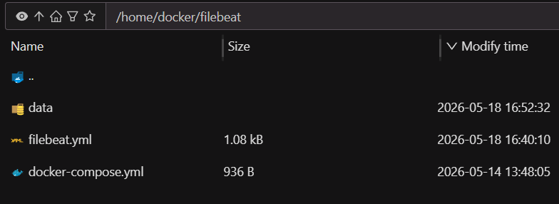
> ⚠️ **权限防闪退挂载**：Filebeat 对其断点追踪 data 目录权限要求极严。在 Docker 挂载启动前，如果在启动日志中看到权限报错，请立刻在宿主机执行授权指令：`chmod -R 777 ./data`。

### 3. 部署可视化看板：Kibana 8.x
> 完整配置文件获取：[点击调整Github](https://github.com/RemainderTime/docker-dosc/tree/master/kibana)

最后，我们部署前端的可视化看板 Kibana。在 ES 8.x 版本中，这里有一个极具欺骗性的生产巨坑。

🚨 **避坑指南**：在老版本中，Kibana 往往直接用超级管理员 `elastic` 连 ES。但在 ES 8.x 出于安全防御机制，官方**硬性切断并禁止**使用超级管理员账号作为 Kibana 后台连接 ES 的通信凭证。否则，Kibana 会启动失败并疯狂刷 `value of "elastic" is forbidden`。

**极简启动步骤**：
1. **重置内置账号密码**：借助刚才已经跑起来的 ES 容器，在服务器终端直接重置系统的专属通信账号密码：
   ```bash
   docker exec -it elasticsearch /usr/share/elasticsearch/bin/elasticsearch-reset-password -u kibana_system -i
   ```
2. **编写并启动 Docker Compose**：创建 Kibana 的 `docker-compose.yml`，填入刚刚为 `kibana_system` 重置得到的密码，一键拉起容器：
```yaml
  version: '3.8'
  services:
    kibana:
      image: docker.elastic.co/kibana/kibana:8.18.1  # 建议与 Filebeat 版本保持一致
      container_name: kibana
      restart: always
      ports:
        - "5601:5601"
      environment:
        - SERVER_NAME=kibana
        # 指向你 Elasticsearch 的内网地址
        - ELASTICSEARCH_HOSTS=http://172.16.0.3:9200
        # 必须使用 kibana_system 这个专用账号
        - ELASTICSEARCH_USERNAME=kibana_system
        - ELASTICSEARCH_PASSWORD= 密码
        # 开启中文界面
        - I18N_LOCALE=zh-CN
        - TZ=Asia/Shanghai
```
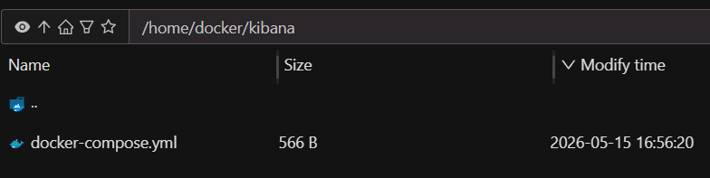

> **认知盲区提示**：当您通过浏览器打开 `http://你的IP:5601` 看到登录页面时，**请务必注意：登入前端 UI 界面依然需要输入默认超级管理员账号 `elastic` 和它的密码！** `kibana_system` 账号仅用作 Kibana 看板程序在后台与 ES 通信，无法用于前端网页登录。

* **💡 【核心运维必备】

## 业务端日志的无侵入 JSON 改造
“三件套”基础设施搭建完毕后，我们回到 Spring Cloud 微服务项目中。为了让 Filebeat 能够极速“无脑搬运”，我们要将项目输出的本地日志直接格式化为 JSON。

### 1. 引入 JSON 编码器依赖
首先，在**父工程（聚合层）**的 `pom.xml` 的 `<dependencyManagement>` 中锁定版本：
```xml
<!-- 1. 父工程 pom.xml 中统一管理依赖版本 -->
<dependencyManagement>
    <dependencies>
        <dependency>
            <groupId>net.logstash.logback</groupId>
            <artifactId>logstash-logback-encoder</artifactId>
            <version>7.4</version>
        </dependency>
    </dependencies>
</dependencyManagement>
```
然后，在各个需要采集日志的**具体微服务模块**（如 `cloud-gateway`, `cloud-common`）的 `pom.xml` 中引入依赖：
```xml
<!-- 2. 具体业务微服务模块 pom.xml 中引入生效 -->
<dependency>
    <groupId>net.logstash.logback</groupId>
    <artifactId>logstash-logback-encoder</artifactId>
</dependency>
```

### 2. logback-spring.xml 实现持久化输出
接着，调整具体微服务下的 `logback-spring.xml`。我们保留 Console 输出以便本地排查，仅将输出到文件的持久化格式转为 JSON。这一步对原有的业务代码实现了 **百分之百的零侵入**：
```xml
<!-- 提取部分关键配置，完整项目详见 项目 -->
<appender name="INFO_FILE" class="ch.qos.logback.core.rolling.RollingFileAppender">
    <file>${LOG_PATH}/info.json</file>
    <rollingPolicy class="ch.qos.logback.core.rolling.SizeAndTimeBasedRollingPolicy">
        <fileNamePattern>${LOG_PATH}/history/info.%d{yyyy-MM-dd}.%i.json.gz</fileNamePattern>
        <maxFileSize>500MB</maxFileSize>
        <maxHistory>15</maxHistory>
        <totalSizeCap>30GB</totalSizeCap>
    </rollingPolicy>
    <encoder class="net.logstash.logback.encoder.LogstashEncoder">
        <includeContext>false</includeContext>
        <includeMdc>true</includeMdc> <!-- 必须开启：自动将代码 MDC 里的 traceId 解析为同级 JSON 字段 -->
        <customFields>{"serviceName":"${APP_NAME}"}</customFields>
    </encoder>
</appender>
```
* **`maxHistory=15` 与 `totalSizeCap=30GB`**：经验公式设定。最多保留半个月本地历史，按单日高峰 500M 估算不超过 7.5G。设置 30G 硬上限，坚决防止日志死锁撑爆宿主机磁盘。

# 六、运行效果与日志过期策略
## 效果测试
日志数据不落盘是不踏实的。配置完毕后，我们需要完成一次业务接口的调用，并回到 Kibana 进行数据核验：

注： 确保相关服务都已成功启动
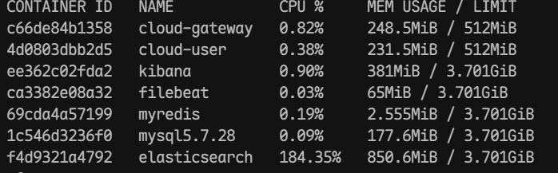
1. 调用登录接口
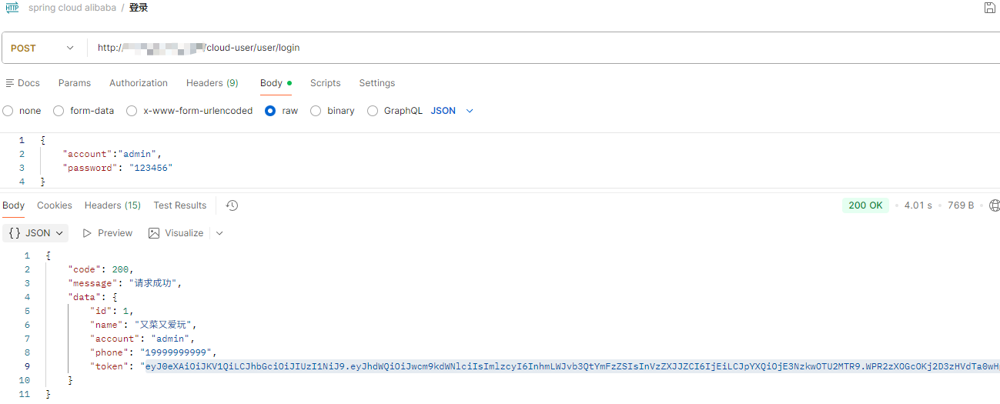
2. 获取用户信息
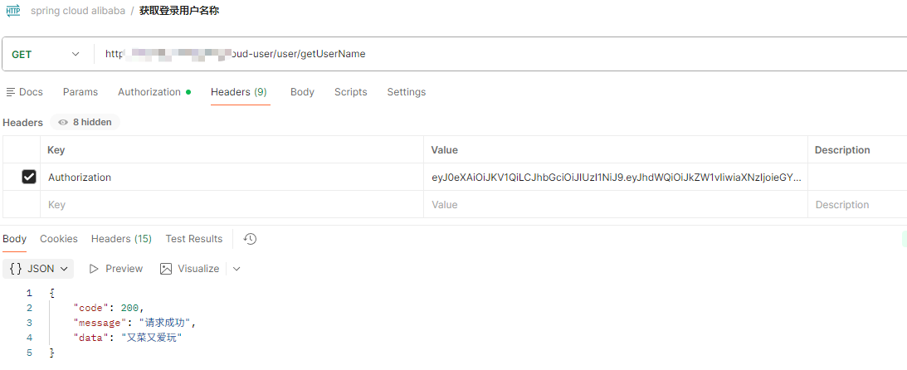
3. 参看网关服务容器中日志
```bash
docker logs -f cloud-gateway
```
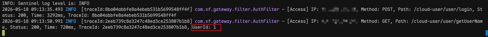
4. 打开浏览器访问 `http://你的IP:5601`，通过 `elastic` 账户登入 UI。
5. 左侧菜单进入 **Stack Management -> Index Management**，检查今天是否成功生成了 `microservice-logs-xxx`索引。
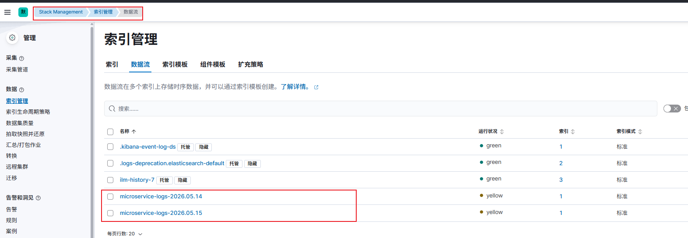
6. 进入 **Discover** 视图配置日志文件获取规则
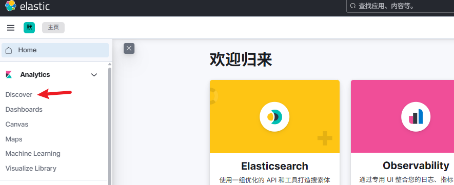
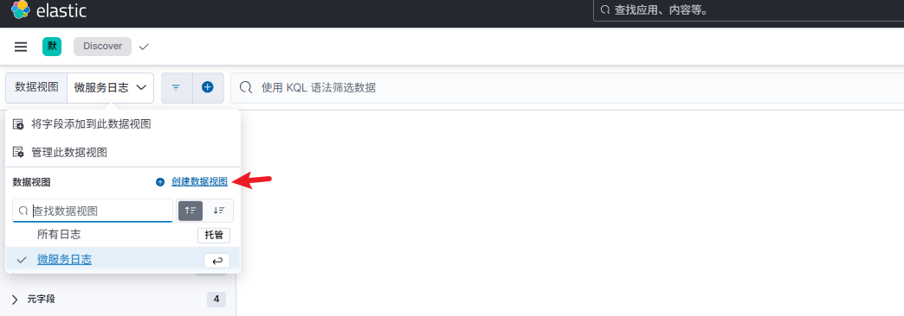
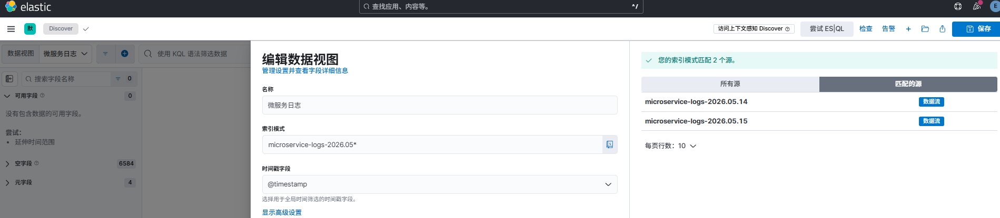
7. 保存日志获取规则后，在搜索框直接键入你的 `traceId`。预期的正确反馈是：能瞬间加载出横跨网关和各个业务服务的请求详情。
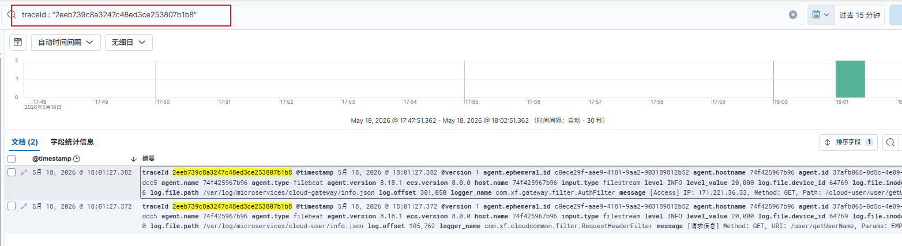
## ES日志文件过期策略(重要)
在 Kibana 中配置日志自动过期（防磁盘撑爆）：
Filebeat 每天都在源源不断地把日志推送进 ES。如果听之任之，Elasticsearch 占用的磁盘空间会无限膨胀，直到拖垮整台服务器.
1. 进入 **Stack Management -> Index Management（索引管理） -> 索引模板**
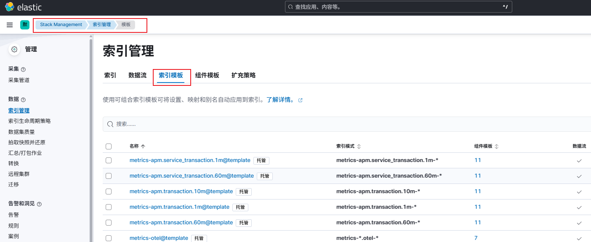
2. 找到在filebeat中配置的索引模板，点击 **Edit** 按钮
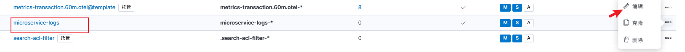
3. 在第一步开启数据保留并设置保留时间，然后一直下一步直到完成保存
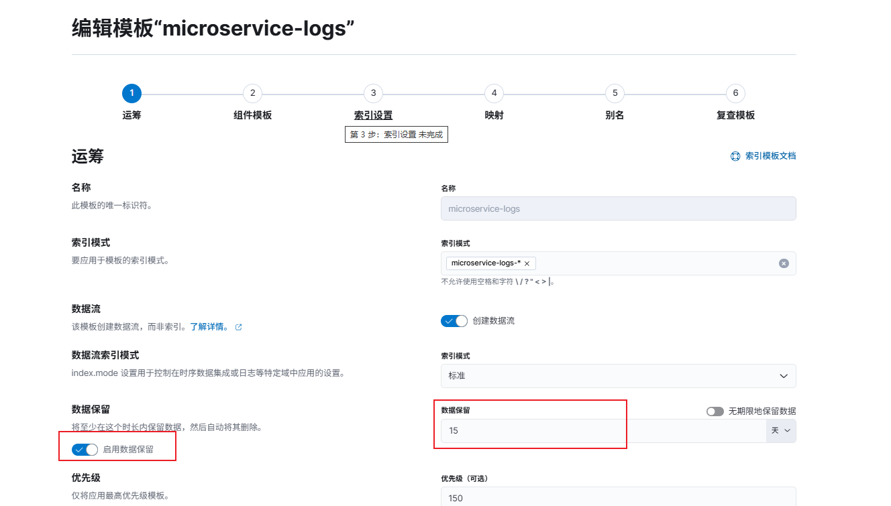
## 七、总结
通过将 Logback 配置为 JSON 文件滚动输出，并结合极其轻量化的 Filebeat 采集端，我们成功以趋近于零的代码侵入度，在资源极其拮据的服务器上完成了微服务全链路日志聚合追踪体系的跃迁。
